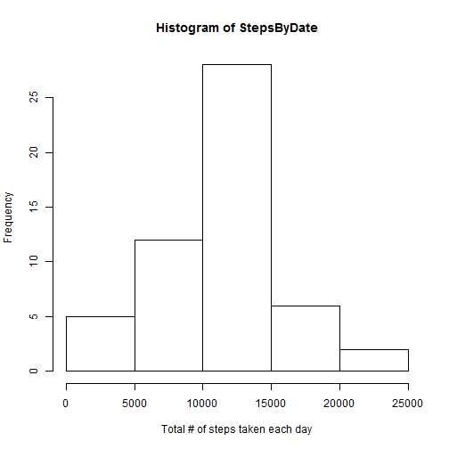
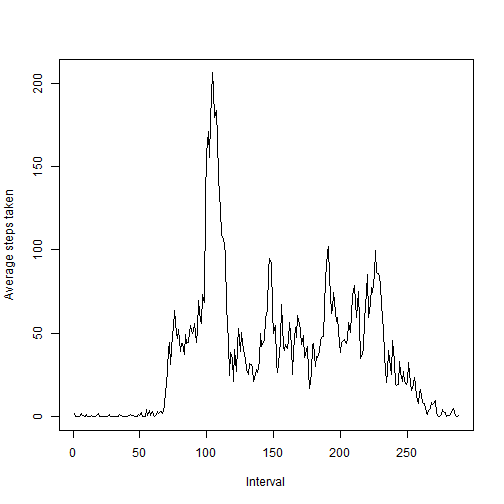

My first R Markdown project: Reproducible Data Peer Assignment 1 

This assignment makes use of data from a personal activity monitoring device. This device collects data at 5 minute intervals through out the day. The data consists of two months of data from an anonymous individual collected during the months of October and November, 2012 and include the number of steps taken in 5 minute intervals each day.

Data

The data for this assignment can be downloaded from the course web site:

Dataset: Activity monitoring data [52K]
The variables included in this dataset are:

steps: Number of steps taking in a 5-minute interval (missing values are coded as NA)

date: The date on which the measurement was taken in YYYY-MM-DD format

interval: Identifier for the 5-minute interval in which measurement was taken

The dataset is stored in a comma-separated-value (CSV) file and there are a total of 17,568 observations in this dataset.

## Part 0: Loading and preprocessing the data

```r
## sets the right working directory and reads the CSV file into R.

setwd("~/Coursera Data Science/repdata/RepData_PeerAssessment1")
activity <- read.csv("activity.csv")
```

## Part 1: What is the mean total number of steps taken per day?

```r
## sums the number of steps by date and plots a histogram. 

StepsByDate <- tapply(activity$steps, activity$date, sum, na.rm=FALSE)
hist(StepsByDate, xlab="Total # of steps taken each day")
```

 

```r
## Calculate and report the mean and median total number of steps taken per day
MeanSteps <- mean(StepsByDate, na.rm=TRUE)
MeanSteps
```

```
## [1] 10766.19
```

```r
MedianSteps <- median(StepsByDate, na.rm=TRUE)
MedianSteps
```

```
## [1] 10765
```

## Part 2: What is the average daily activity pattern?


```r
## Make a time series plot (i.e. type = "l") of the 5-minute interval (x-axis) and the average number of steps taken, averaged across all days (y-axis)
## In other words, for each 5-minute time interval, what's the average across all days? Plot this. 

averages <- tapply(activity$steps, activity$interval, mean, na.rm=TRUE)
plot(averages, type="l", xlab = "Interval", ylab="Average steps taken")
```

 

```r
## Which 5-minute interval, on average across all the days in the dataset, contains the maximum number of steps?

averages[which.max(averages)]
```

```
##      835 
## 206.1698
```

## Part 3: Imputing missing values
There are a number of days/intervals where there are missing values (coded as NA). The presence of missing days may introduce bias into some calculations or summaries of the data. We need to calculate and report the total number of missing values in the dataset, then replace the NAs with...something. 


```r
## Calculate and report the total number of missing values in the dataset (i.e. the total number of rows with NAs)
## How many are missing? Return a list of true and false values for activity

missing <- is.na(activity$steps)

## count 'em

table(missing)
```

```
## missing
## FALSE  TRUE 
## 15264  2304
```

```r
## Devise a strategy for filling in all of the missing values in the dataset. The strategy does not need to be sophisticated. For example, you could use the mean/median for that day, or the mean for that 5-minute interval, etc.

## let's use the mean for that interval, makes more sense than doing it by day. people have to sleep at night
## Create a new dataset that is equal to the original dataset but with the missing data filled in.

## Make a histogram of the total number of steps taken each day and Calculate and report the mean and median total number of steps taken per day. Do these values differ from the estimates from the first part of the assignment? What is the impact of imputing missing data on the estimates of the total daily number of steps?

## Are there differences in activity patterns between weekdays and weekends?

## For this part the weekdays() function may be of some help here. Use the dataset with the filled-in missing values for this part.

## Create a new factor variable in the dataset with two levels - "weekday" and "weekend" indicating whether a given date is a weekday or weekend day.

## Make a panel plot containing a time series plot (i.e. type = "l") of the 5-minute interval (x-axis) and the average number of steps taken, averaged across all weekday days or weekend days (y-axis). See the README file in the GitHub repository to see an example of what this plot should look like using simulated data.
```

